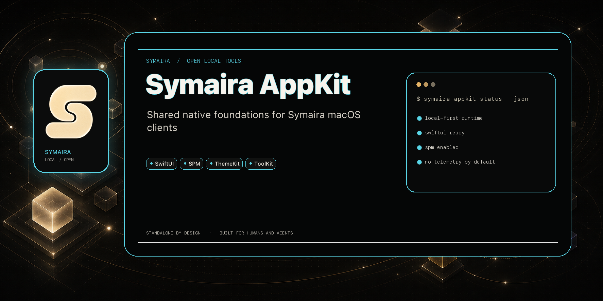

# Symaira AppKit

[](https://github.com/danieljustus/symaira-appkit/actions/workflows/ci.yml) [](https://github.com/danieljustus/symaira-appkit/releases/latest) [](https://github.com/danieljustus/symaira-appkit/actions/workflows/ci.yml) [](LICENSE) [](https://swift.org)



Shared Swift foundations for the macOS clients of the [Symaira](https://symaira.com) ecosystem — the GUI counterpart to [`symaira-corekit`](https://github.com/danieljustus/symaira-corekit).

Every Symaira app stays fully standalone: this package is consumed as a **pinned SPM dependency** (exact version), never as a required runtime service.

## Why symaira-appkit

- **Zero third-party dependencies** — Foundation, SwiftUI and Security only; nothing extra to audit per app.
- **One pinned dependency per app** — every client builds against the exact version it was released with; breaking changes are explicit, not accidental.
- **Shared foundation, standalone apps** — theme, CLI runner, tool detection, keychain, update check, daemon supervision and ingest contracts in one place, with a version handshake so apps and cores never silently disagree.

> **Status:** pre-1.0. Breaking API changes bump the minor version — review the [CHANGELOG](CHANGELOG.md) before bumping your pin.

## Install

Add the package as an exact-pinned dependency in the client app's `Package.swift`:

```swift
.package(url: "https://github.com/danieljustus/symaira-appkit.git", exact: "0.12.0")
```

## Modules

| Product | Purpose |
| :--- | :--- |
| `SymairaTheme` | Cross-platform design foundation: adaptive Symaira tokens, a Dynamic-Type-backed type scale (`SymairaTypography`, `.symairaText(_:)`), Apple materials and Liquid Glass, backgrounds, surfaces, controls, form scaffolding (`SymairaFormSection`, `SymairaFormRow`, `.symaira` text fields), feedback and status states, and accessibility-aware fallbacks. Includes legacy `Color.symaira*` aliases. |
| `SymairaCLIRunner` | Subprocess execution for Symaira CLIs: mandatory timeout, stderr capture, snake_case JSON decoding, unified `CLIRunnerError`. |
| `SymairaToolKit` | `SymairaToolRegistry` (single source of truth for all tools), `BinaryLocator` (bundle → exe dir → PATH → Homebrew prefixes → user override), `ToolDetector` with the `version --json` schema handshake. |
| `SymairaKeychain` | Keychain wrapper with data-protection storage (`kSecAttrAccessibleAfterFirstUnlockThisDeviceOnly`), iCloud-sync disabled, service-namespaced `dev.symaira.<app>`, and automatic legacy-item migration. |
| `SymairaUpdateCheck` | GitHub latest-release checker with disk cache, stable-semver comparison, cosign keyless signature verification, install-method detection (rejects Homebrew-managed binaries), and streaming asset downloads with progress callbacks. |
| `SymairaDaemonKit` | `DaemonSupervisor` for launching and supervising long-running Symaira core daemon processes. |
| `SymairaIngestContract` | JSON contract clients for the ingest rules/mail config and ReOCR requests (the engine ships inside `symdesk`). |
| `SymairaMCP` | Shared MCP server plumbing: `MCPServer`, stdio `MCPTransport` with message-size guard, and JSON-RPC `MCPTypes` with machine-readable `MCPError` payloads. |

### Platform availability

The package declares `.iOS(.v17)` alongside `.macOS(.v14)`, but availability is
uneven per product. Where a product is **mixed**, the macOS-only pieces are
wrapped in `#if os(macOS)`, so referencing them from an iOS target is a
compile error, not a silently empty API.

| Product | iOS | Notes |
| :--- | :--- | :--- |
| `SymairaTheme` | Full | Has explicit `os(iOS)` branches. |
| `SymairaKeychain` | Full | Security framework APIs behave the same on both platforms. |
| `SymairaMCP` | Full | No macOS-specific APIs; stdio transport works but is unusual for an iOS app to use. |
| `SymairaCLIRunner` | **Unavailable** | Entire module is `#if os(macOS)` (subprocess execution does not exist on iOS). Importing it still succeeds; using any symbol from it fails to build. |
| `SymairaDaemonKit` | **Unavailable** | `DaemonSupervisor` is `#if os(macOS)` for the same reason (wraps `SymairaCLIRunner`). |
| `SymairaToolKit` | Mixed | `SymairaTool` / `SymairaToolRegistry` (plain data) build on iOS. `BinaryLocator` and `ToolDetector` are `#if os(macOS)` — using them from an iOS target fails to build. |
| `SymairaIngestContract` | Mixed | The `ReOCRClient` protocol and all contract/DTO types build on iOS. The concrete `SymingestReOCRClient` (which shells out via `SymairaToolKit`) is `#if os(macOS)`. |
| `SymairaUpdateCheck` | Mixed | Release-check, semver, and asset-verification logic build on iOS; the pieces that shell out to install/replace the running binary (`SubprocessRunner` and the install/apply paths that use it) are `#if os(macOS)`. |

A macOS-only product still **links** cleanly into an iOS target — SwiftPM does
not fail the dependency graph over this — only *using* one of its symbols
fails to build. `SymairaTheme`, `SymairaKeychain`, and `SymairaMCP` are safe to
adopt in an iOS client today.

## Usage

Review the [CHANGELOG](CHANGELOG.md) before bumping your pin — every release documents its additions, fixes, and breaking changes.

```swift
import SymairaToolKit

let detector = ToolDetector()
if let desk = await detector.detect(SymairaToolRegistry.tool(id: "symdesk")!) {
    try detector.requireSchemaVersion(1, of: desk)
    let results = try await CLIRunner().runDecoding(
        SearchResults.self,
        executable: desk.location.url,
        arguments: ["search", "query", "--json"]
    )
}
```

### Update flow

```swift
import SymairaUpdateCheck

let applier = UpdateApplier(
    checkInstallMethod: true,
    cosignConfig: CosignConfig(
        identityRegExp: "https://github.com/danieljustus/",
        issuer: "https://token.actions.githubusercontent.com"
    )
)
let result = try await applier.applyBundle(release: release, targetPath: installURL)
```

### Shared UI foundation

```swift
import SwiftUI
import SymairaTheme

struct Dashboard: View {
    var body: some View {
        ZStack {
            SymairaBackdrop(gridStyle: .dots)

            VStack(spacing: SymairaSpacing.xLarge) {
                SymairaNotice(
                    title: "Core connected",
                    message: "Local features are ready.",
                    tone: .positive
                )

                Text("Content uses a standard Apple material.")
                    .padding(SymairaSpacing.xLarge)
                    .glassCard()

                SymairaGlassEffectContainer {
                    HStack {
                        Button("Cancel") {}
                            .symairaButtonStyle(.secondary)
                        Button("Continue") {}
                            .symairaButtonStyle(.primary)
                    }
                }
            }
            .padding()
        }
    }
}
```

Use Liquid Glass for controls and navigation chrome, not as the background of
every content card. `symairaButtonStyle`, `symairaGlassChrome`, and
`SymairaGlassEffectContainer` adopt the native macOS/iOS 26 effects and provide
material or opaque accessibility fallbacks on earlier systems. See
[`DESIGN.md`](DESIGN.md) for the design rules and migration guidance.

## Build & Test

```bash
make build
make test
```

The Makefile resolves a full Xcode toolchain and exports `DEVELOPER_DIR` for
the build itself, so these work regardless of what `xcode-select` points at.
A bare `swift build` fails when Command Line Tools are the active developer
directory, since they ship no XCTest and no SwiftUI macro plugins.
`make toolchain` shows which toolchain will be used.

Requires macOS 14+ or iOS 17+, Swift 6, and a full Xcode installation. Native Liquid Glass is enabled on
macOS/iOS 26+ when built with a compatible SDK.

## License

Apache-2.0
